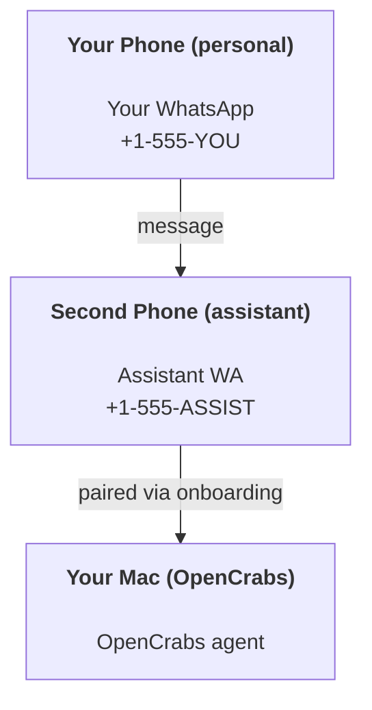

# Building a personal assistant with OpenCrabs

OpenCrabs is a self-hosted AI agent runtime that lives on your machine and talks through messaging channels: Telegram, WhatsApp, Discord, Slack, Trello, Signal and Google Chat. This guide is the "personal assistant" setup: one dedicated WhatsApp number (or Telegram account) that behaves like your always-on agent.

## ⚠️ Safety first

You're putting an agent in a position to:

- run commands on your machine (depending on your tool approval policy)
- read/write files in your workspace
- send messages back out through the connected channels

Start conservative:

- Always allowlist who the bot answers (`[channels.whatsapp] allowed_phones`, `[channels.telegram] allowed_users` etc. — never run open-to-the-world on your personal Mac).
- Use a dedicated WhatsApp number for the assistant.
- Keep `approval_policy` on `"ask"` until you trust the setup; move to `"auto-session"` deliberately, not by accident.

## Prerequisites

- OpenCrabs installed and onboarded — see [Getting Started](/start/getting-started) if you haven't done this yet
- A second phone number (SIM/eSIM/prepaid) for the assistant, if you're doing the WhatsApp setup

## The two-phone setup (recommended for WhatsApp)

You want this:



If you pair your personal WhatsApp to OpenCrabs, every message you receive becomes "agent input". That's rarely what you want.

## 5-minute quick start

1. Run the onboarding wizard — it walks you through provider keys and channel pairing (WhatsApp shows a QR you scan with the assistant phone):

```bash
opencrabs onboard
```

2. Decide how it runs:

- `opencrabs` (or `opencrabs chat`) — interactive TUI, the default. The channel bots run alongside.
- `opencrabs daemon` — headless mode: no TUI, channel bots only (Telegram, Discord, Slack, WhatsApp). This is what the systemd/LaunchAgent service installs.

3. Put a minimal allowlist in `~/.opencrabs/config.toml` (config is TOML):

```toml
[channels.whatsapp]
allowed_phones = ["+15555550123"]
```

Now message the assistant number from your allowlisted phone.

## Give the agent a workspace (AGENTS)

OpenCrabs reads operating instructions and "memory" from its workspace directory.

By default, OpenCrabs uses `~/.opencrabs/` as the agent workspace, and will create it (plus starter `SOUL.md`, `USER.md`, `AGENTS.md`, `TOOLS.md`, `MEMORY.md`, `CODE.md`, `SECURITY.md`, `BOOT.md`, `HEARTBEAT.md`) automatically on setup/first agent run. Seeding never overwrites: a file you have already edited is left exactly as it is. `MEMORY.md` is loaded for normal sessions only, not for shared ones. Subagent sessions only inject `AGENTS.md` and `TOOLS.md`.

Tip: treat this folder like OpenCrabs's "memory" and make it a git repo (ideally private) so your `AGENTS.md` + memory files are backed up. If git is installed, brand-new workspaces are auto-initialized.

Full workspace layout + backup guide: [Agent workspace](/concepts/agent-workspace)
Memory workflow: [Memory](/concepts/memory)

Optional: named profiles give each setup its own workspace — `~/.opencrabs/` for the default profile, `~/.opencrabs/profiles/<name>/` with `opencrabs -p <name>`.

## The config that turns it into "an assistant"

OpenCrabs defaults to a good assistant setup, but you'll usually want to tune:

- persona/instructions in `SOUL.md`
- default provider/model for chat sessions
- tool approval policy
- periodic checks (a cron job that reads `HEARTBEAT.md` — see Cron)

Example:

```toml
[agent]
# provider/model new sessions start on (unset = inherit most recent session)
default_provider = "anthropic"
default_model = "claude-sonnet-4-6"

# "ask" | "auto-session" | "auto-always"
approval_policy = "ask"

# context window budget before compaction kicks in (default 200000)
context_limit = 200000

[channels.whatsapp]
allowed_phones = ["+15555550123"]
# bot owner defaults to the first allowed_phones entry; set explicitly if needed
bot_owner = ["+15555550123"]
# who the bot answers: "auto" (legacy), "owner_only", "allowlist", or "open"
response_policy = "owner_only"
```

## Sessions and memory

- Session files: `~/.opencrabs/agents/<agentId>/sessions/`
- `/new` (or `/clear`) starts a fresh session for that chat; the agent replies with a short hello to confirm.
- `/compact [instructions]` compacts the session context and reports the remaining context budget.
- Session provider/model can be switched per-session with `opencrabs session set-model` or `/models`.

## Periodic checks (HEARTBEAT.md + cron)

There is no built-in heartbeat timer. `HEARTBEAT.md` is a plain checklist brain file (seeded empty in the workspace); it does nothing on its own. To run periodic checks, create a cron job whose prompt reads it — e.g. *"Every 30 minutes, read HEARTBEAT.md and act on anything that needs attention; if nothing does, stay quiet."* Cron jobs are isolated sessions with their own provider/model and a `--deliver` channel.

## Media in and out

Inbound attachments (images/video sent to the bot) land on disk and enter the conversation as markers the agent can see and act on:

- `<>` — image; the agent views it directly or via a vision tool
- `<<VID:/path/to/file>>` — video; the agent extracts frames or uses a video analysis tool

Outbound, the agent sends media through the channel send tools (e.g. a Telegram photo or WhatsApp document) rather than inline syntax.

## Operations checklist

```bash
opencrabs status              # version, provider, channels, database, brain
opencrabs doctor              # diagnostics: config, provider, channel health, tools
opencrabs doctor --fix        # also repairs: stuck cron rows, stale plan markers, loose permissions
opencrabs channel list        # configured channels and their status
opencrabs channel doctor      # health checks on all enabled channels
opencrabs logs status         # log file location
opencrabs logs view --lines 50
```

Logs live under `~/.opencrabs/logs/` (one file per day: `opencrabs.YYYY-MM-DD`).

## Next steps

- First-run details: [Getting Started](/start/getting-started), [Onboarding overview](/start/onboarding-overview)
- Reference docs (providers, plans, templates): `src/docs/reference/`
- Cron jobs and scheduled work: README → "Cron Jobs"
