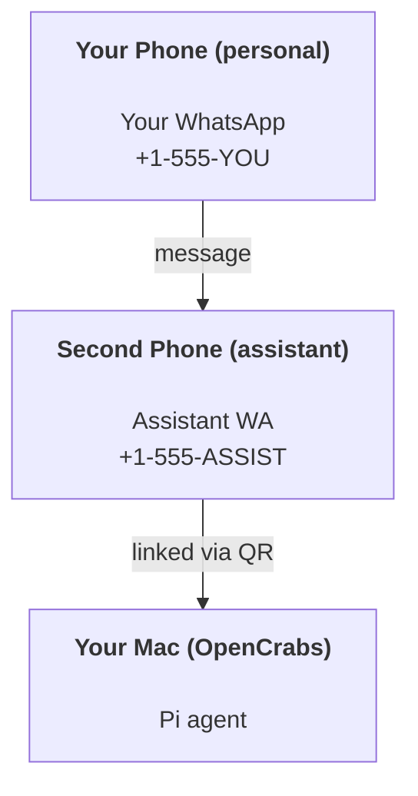

# Building a personal assistant with OpenCrabs

OpenCrabs is a WhatsApp + Telegram + Discord + iMessage gateway for **Pi** agents. Plugins add Mattermost. This guide is the "personal assistant" setup: one dedicated WhatsApp number that behaves like your always-on agent.

## ⚠️ Safety first

You’re putting an agent in a position to:

- run commands on your machine (depending on your Pi tool setup)
- read/write files in your workspace
- send messages back out via WhatsApp/Telegram/Discord/Mattermost (plugin)

Start conservative:

- Always set `channels.whatsapp.allowFrom` (never run open-to-the-world on your personal Mac).
- Use a dedicated WhatsApp number for the assistant.

## Prerequisites

- OpenCrabs installed and onboarded — see [Getting Started](/start/getting-started) if you haven't done this yet
- A second phone number (SIM/eSIM/prepaid) for the assistant

## The two-phone setup (recommended)

You want this:



If you link your personal WhatsApp to OpenCrabs, every message to you becomes “agent input”. That’s rarely what you want.

## 5-minute quick start

1. Pair WhatsApp Web (shows QR; scan with the assistant phone):

```bash
opencrabs channels login
```

2. Start the Gateway (leave it running):

```bash
opencrabs gateway --port 18789
```

3. Put a minimal config in `~/.opencrabs/config.toml`:

```json5
{
  channels: { whatsapp: { allowFrom: ["+15555550123"] } },
}
```

Now message the assistant number from your allowlisted phone.

When onboarding finishes, we auto-open the dashboard and print a clean (non-tokenized) link. If it prompts for auth, paste the token from `gateway.auth.token` into Control UI settings. To reopen later: `opencrabs dashboard`.

## Give the agent a workspace (AGENTS)

OpenCrabs reads operating instructions and “memory” from its workspace directory.

By default, OpenCrabs uses `~/.opencrabs/` as the agent workspace, and will create it (plus starter `SOUL.md`, `USER.md`, `AGENTS.md`, `TOOLS.md`, `MEMORY.md`, `CODE.md`, `SECURITY.md`, `BOOT.md`, `HEARTBEAT.md`) automatically on setup/first agent run. Seeding never overwrites: a file you have already edited is left exactly as it is. `MEMORY.md` is loaded for normal sessions only, not for shared ones. Subagent sessions only inject `AGENTS.md` and `TOOLS.md`.

Tip: treat this folder like OpenCrabs’s “memory” and make it a git repo (ideally private) so your `AGENTS.md` + memory files are backed up. If git is installed, brand-new workspaces are auto-initialized.

```bash
opencrabs setup
```

Full workspace layout + backup guide: [Agent workspace](/concepts/agent-workspace)
Memory workflow: [Memory](/concepts/memory)

Optional: named profiles give each setup its own workspace — `~/.opencrabs/` for the default profile, `~/.opencrabs/profiles/<name>/` with `opencrabs -p <name>`.

## The config that turns it into “an assistant”

OpenCrabs defaults to a good assistant setup, but you’ll usually want to tune:

- persona/instructions in `SOUL.md`
- thinking defaults (if desired)
- periodic checks (a cron job that reads `HEARTBEAT.md` — see Cron)

Example:

```json5
{
  logging: { level: "info" },
  agent: {
    model: "anthropic/claude-opus-4-6",
    workspace: "~/.opencrabs/",
    thinkingDefault: "high",
    timeoutSeconds: 1800,
  },
  channels: {
    whatsapp: {
      allowFrom: ["+15555550123"],
      groups: {
        "*": { requireMention: true },
      },
    },
  },
  routing: {
    groupChat: {
      mentionPatterns: ["@OpenCrabs", "OpenCrabs"],
    },
  },
  session: {
    scope: "per-sender",
    resetTriggers: ["/new", "/reset"],
    reset: {
      mode: "daily",
      atHour: 4,
      idleMinutes: 10080,
    },
  },
}
```

## Sessions and memory

- Session files: `~/.opencrabs/agents/<agentId>/sessions/{{SessionId}}.jsonl`
- Session metadata (token usage, last route, etc): `~/.opencrabs/agents/<agentId>/sessions/sessions.json` (legacy: `~/.opencrabs/sessions/sessions.json`)
- `/new` or `/reset` starts a fresh session for that chat (configurable via `resetTriggers`). If sent alone, the agent replies with a short hello to confirm the reset.
- `/compact [instructions]` compacts the session context and reports the remaining context budget.

## Periodic checks (HEARTBEAT.md + cron)

There is no built-in heartbeat timer. `HEARTBEAT.md` is a plain checklist brain file (seeded empty in the workspace); it does nothing on its own. To run periodic checks, create a cron job whose prompt reads it — e.g. *"Every 30 minutes, read HEARTBEAT.md and act on anything that needs attention; if nothing does, stay quiet."* Cron jobs are isolated sessions with their own provider/model and a `--deliver` channel.

## Media in and out

Inbound attachments (images/audio/docs) can be surfaced to your command via templates:

- `{{MediaPath}}` (local temp file path)
- `{{MediaUrl}}` (pseudo-URL)
- `{{Transcript}}` (if audio transcription is enabled)

Outbound attachments from the agent: include `MEDIA:<path-or-url>` on its own line (no spaces). Example:

```
Here’s the screenshot.
MEDIA:https://example.com/screenshot.png
```

OpenCrabs extracts these and sends them as media alongside the text.

## Operations checklist

```bash
opencrabs status          # local status (creds, sessions, queued events)
opencrabs status --all    # full diagnosis (read-only, pasteable)
opencrabs status --deep   # adds gateway health probes (Telegram + Discord)
opencrabs health --json   # gateway health snapshot (WS)
```

Logs live under `/tmp/opencrabs/` (default: `opencrabs-YYYY-MM-DD.log`).

## Next steps

- WebChat: [WebChat](/web/webchat)
- Gateway ops: [Gateway runbook](/gateway)
- Cron + wakeups: [Cron jobs](/automation/cron-jobs)
- macOS menu bar companion: [OpenCrabs macOS app](/platforms/macos)
- iOS node app: [iOS app](/platforms/ios)
- Android node app: [Android app](/platforms/android)
- Windows status: [Windows (WSL2)](/platforms/windows)
- Linux status: [Linux app](/platforms/linux)
- Security: [Security](/gateway/security)
